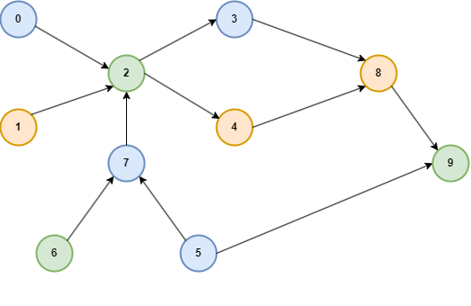

# Hangfire ASP.NET Calculation Engine

## Библиотека распределенных вычислений - Calculation Engine

Библиотека позволяет разбивать объемные вычислительные задачи на отдельные части и запускать эти части в расчетном кластере.

Кластер представляет собой горизонтально масштабируемый набор хостов - однотипных виртуалок, докер контейнеров или процессов.

Каждый хост кластера - Hangfire Agent - ASP.NET host с установленным Hangfire Server. 

Все Hangfire агенты используют единую БД PgSql.

Для использования кластера вычислительная задача разбивается на отдельные подзадачи - расчетные единицы.

Исходная задача формируется в виде графа вычислений, представляющего собой направленный ациклический граф - DAG.

Каждая вершина графа - расчетная единица (Calculation Unit).

Расчетные единицы одного графа могут выполняться на различных Hangfire агентах:


Каждая расчетная единица реализуется в виде пары: Mediator Request + Mediator Handler.

Все расчетные единицы образуют сборку бизнес логики - *.Application.dll, которая используется Hangfire агентами для запуска задач.

Все выполняемые задачи (jobs) на стороне Hangfire агента имеют единый вид и состоят из одного вызова: Mediator.Send(Request)

Инфраструктура медиатора находит соответствующий хендлер и выполняет его метод: Handler.Handle(Request)

## Рабочий поток

В Web API приходит реквест на выполнение объемной вычислительной задачи - например, создание репорта.

В хендлере - обработчике запрса - формируется граф вычислений в виде набора расчетных единиц - оберток над Mediator Request.

Граф вычислений валидируется и сериализуется в БД.
В Hangfire посылается запрос - EnqueueGraphRequest, в котором передается ID созданного графа.

На клиента уходит ответ с ID графа и результатом его постановки на обработку.

На стороне HF агента в какой-то момент выполнится Job, который вызовет метод EnqueueGraphHandler.
Хендлер загрузит граф из БД, распарсит его, для вершин графа создаст набор джобов - по сути - Mediator Request-ов - и поставит их 
на исполнение в Hangfire

Для обхода графа и выстраивания очередности джобов используются алгоритмы из теории графов: DFS, BFS, топологическая сортировка и т.п.

Для вершин графа у которых полустепень захода > 1 встраивается специальный хендлер-синхронизатор JobAwaitingHandler.
Синхронизатор будет ожидать завершения всех "входящих" в вершину джобов прежде чем запустить "исходящие" джобы.

## Доступ к контесту вычислений

Библиотека предоставляет доступ к контексту вычислений через набор репозиториев, доступных через DI из любого Hаndler-а:

- ICalculationGraphRepository - CRUD операции над графами
- ICalculationUnitRepository - CRUD операции над вычислительными единицами
- ICalculationResultRepository - CRUD над результатами расчетов

Для доступа к контексту вычислений реквест должен наследоваться от ICalculationRequest вместо обычного IRequest.

В этом случае будет доступен ID текущего CalculationUnit, через который с помощью вышеперечисленных репозиториев можно получить информацию о родительском графе, его вершинах - других соседних CalculationUnit-ах, а также результатах их работы.

## Предполагаемый вариант использования


## Пример использования

В [примере]() реализован граф вычислений, представленный на картинке:



### Рендер графа и джобов, соответствующих вершинам

``` shell
Vertices:
	[] -> 6
	[] -> 5
	[5,6] -> 7
	[] -> 1
	[] -> 0
	[0,1,7] -> 2
	[2] -> 4
	[2] -> 3
	[3,4] -> 8
	[5,8] -> 9

GraphId=9b818158-90f6-41ca-bb99-5b9321e957b9 enqueued. Jobs=[481,482,484,485,486,488,489,490,492,494]
Job schedule for GraphId=9b818158-90f6-41ca-bb99-5b9321e957b9: Jobs:
	[] -> 481
	[] -> 482
	[482,481] -> 484
	[] -> 485
	[] -> 486
	[486,485,484] -> 488
	[488] -> 489
	[488] -> 490
	[490,489] -> 492
	[482,492] -> 494
```


## Лог выполнения графа hangfire агентом:

``` shell
Start executing Job=481
Enqueued awatingJobId=483 parentJobIds=[482,481]
Start executing Job=482
Start executing Job=485
Enqueued awatingJobId=487 parentJobIds=[486,485,484]
Start executing Job=486
Enqueued awatingJobId=491 parentJobIds=[490,489]
Enqueued awatingJobId=493 parentJobIds=[482,492]
End executing Job=481
End executing Job=482
End waiting for jobs completed. JobIds=[482,481]. Proceed to next job.
Start executing Job=484
End executing Job=485
End executing Job=486
End executing Job=484
End waiting for jobs completed. JobIds=[486,485,484]. Proceed to next job.
Start executing Job=488
End executing Job=488
Start executing Job=489
Start executing Job=490
End executing Job=489
End executing Job=490
End waiting for jobs completed. JobIds=[490,489]. Proceed to next job.
Start executing Job=492
End executing Job=492
End waiting for jobs completed. JobIds=[482,492]. Proceed to next job.
Saving report result for graphId=9b818158-90f6-41ca-bb99-5b9321e957b9. DataItemsCount=9
```


