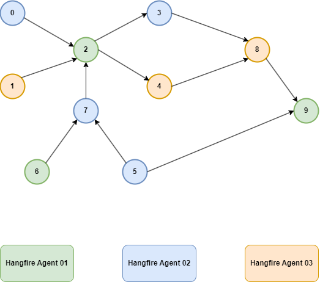

# Библиотека распределенных вычислений (Calculation Engine)

Библиотека позволяет разбивать объемные вычислительные задачи на отдельные части и запускать эти части в расчетном кластере.
Кластер представляет собой горизонтально масштабируемый набор хостов - однотипных виртуалок, докер контейнеров или процессов.
Каждый хост кластера - Hangfire Agent - ASP.NET host с установленным Hangfire Server. 
Все Hangfire агенты используют единую БД PgSql.

Для использования кластера вычислительная задача разбивается на отдельные подзадачи - расчетные единицы.
Исходная задача формируется в виде графа вычислений, представляющего собой направленный ациклический граф - DAG.
Каждая вершина графа - расчетная единица (Calculation Unit).
Расчетные единицы одного графа могут выполняться на различных Hangfire агентах:

Каждая расчетная единица реализуется в виде пары: Mediator Request + Mediator Handler.
Все расчетные единицы образуют сборку бизнес логики - *.Application.dll, которая используется Hangfire агентами для запуска задач.
Все выполняемые задачи (jobs) на стороне Hangfire агента имеют единый вид и состоят из одного вызова: Mediator.Send(Request)
Инфраструктура медиатора находит соответствующий хендлер и выполняет его метод: Handler.Handle(Request)

## Рабочий поток

В Web API приходит реквест на выполнение объемной вычислительной задачи - например, создание репорта.
В хендлере - обработчике запрса - формируется граф вычислений в виде набора расчетных единиц - оберток над Mediator Request.
Граф вычислений валидируется и сериализуется в БД.
В Hangfire посылается запрос - EnqueueGraphRequest, в котором передается ID созданного графа.
На клиента уходит ответ с ID графа и результатом его постановки на обработку.

На стороне HF агента в какой-то момент выполнится Job, который вызовет метод EnqueueGraphHandler.
Хендлер загрузит граф из БД, распарсит его, для вершин графа создаст набор джобов - по сути - Mediator Request-ов - и поставит их на исполнение в Hangfire
Для выстраивания очередности джобов в графе используются известные из теории графов подходы и алгоритмы
- топологическая сортировка, вычисление полустепени захода вершины и т.п.
Для вершин графа у которых полустепень захода > 1 встраивается специальный хендлер-синхронизатор JobAwaitingHandler.
Синхронизатор будет ожидать завершения всех "входящих" в вершину джобов прежде чем запустить "исходящие" джобы.

## Доступ к контесту вычислений

Библиотека предоставляет доступ к контексту вычислений через набор репозиториев, доступных через DI из любого Hаndler-а:

- ICalculationGraphRepository - CRUD операции над графами
- ICalculationUnitRepository - CRUD операции над вычислительными единицами
- ICalculationResultRepository - CRUD над результатами расчетов

Для доступа к контексту вычислений реквест должен наследоваться от ICalculationRequest вместо обычного IRequest.
В этом случае будет доступен ID текущего CalculationUnit, через который с помощью вышеперечисленных репозиториев можно получить
информацию о родительском графе, его вершинах - других соседних CalculationUnit-ах, а также результатах их работы.

## Техническая реализация

Библиотека реализована в виде Nuget-пакета, в который включены сборки
- Graphlib - модель направленного ациклического графа и библиотека типовых алгоритмов над ним
- Core - набоор интерфейсов, базовых классов и моделей реализующих основную логику работы расчетного кластера
- DataAccess - реализация репозиториев доступа к контексту вычислений через EFCore (PgSql)

## Предполагаемый вариант использования

